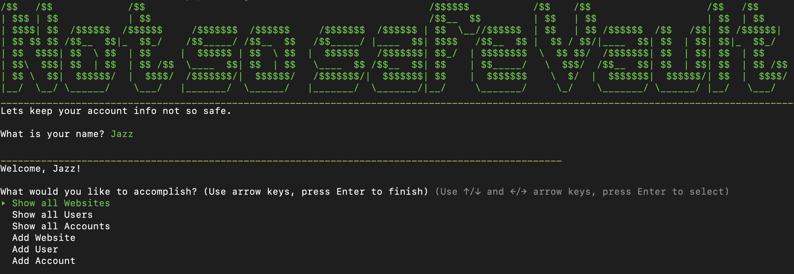
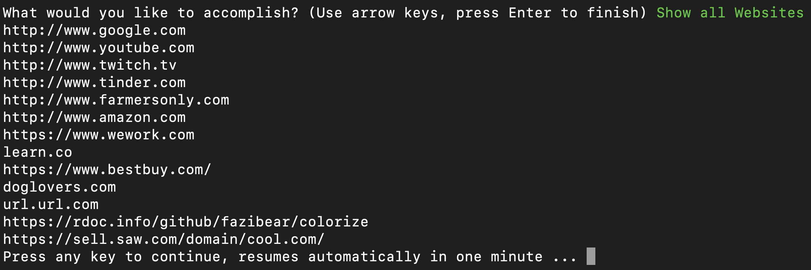
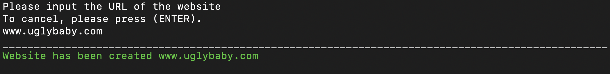
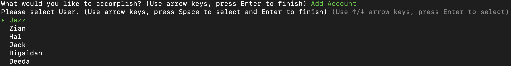
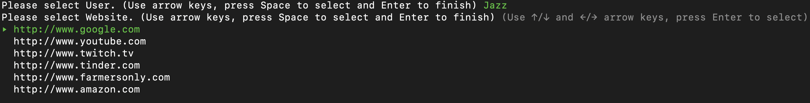
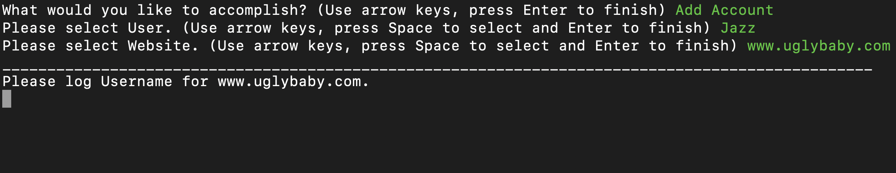
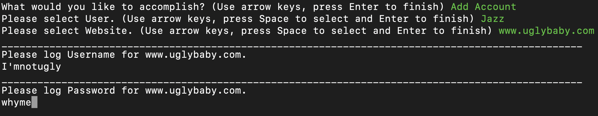
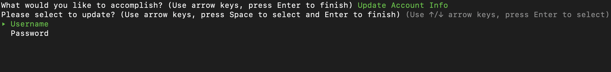
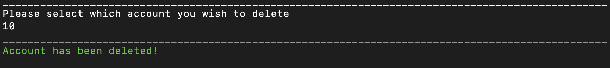
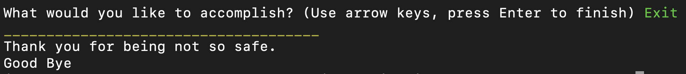

# Not So Safe Vault
## WARNING: 
### Do not keep important information stored in this program

## Features
-Scrolling capabilities with TTT::Prompt
-User friendly error feedback
-Simple data structer

In order to persist information for Not So Safe Vault, this project applies skills such as:
-Object Orientation
-ActiveRecord
-Ruby
-Conditional Logic
-SQLite3

Gems used for this program include:
-tty-prompt
-sinatra-activerecord
-sqlite3
-pry
-require_all
-activerecord, ~> 5.2.3
-tty-prompt"
-artii, ~> 2.1", ">= 2.1.2
-colorize, ~> 0.8.1

Not So Safe Vault install link: https://github.com/jazzbozner/ruby-project-guidelines-seattle-web-120919)

### How to Install

1. Click on the link provided above
2. Fork from repo
3. Clone file to your machine

### How to Run program

1. Open cloned file in your text editor
2. In your terminal type:
-rake db:migrate
-rake db:seed
-ruby bin/run.rb
3. Program will start and prompt you to interact within terminal

### Using Not So Safe Vault: MVP

1. Operator is able to show all Websites
2. Operator is able to show all Users
3. Operator is able to show all Accounts
4. Operator is able to add Website
5. Operator is able to add User
6. Operator is able to add Account
7. Operator is able to update Account Info
8. Operator is able to delete Account Info
9. Operator is able to exit program

### Stretch Goals

-Allowing the user to see when he last updated account info
-Produce the last account that was created
-Show all accounts that belong to specific user
-Implement actual password verification and incription

## Menu Interface

## Show All Pertenent Information

## Add User/Website

## Add Account

## Update Account Info

## Delete Account Info

## Exit

